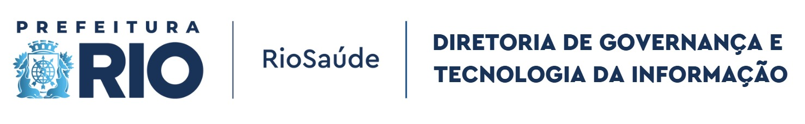

# Documentação dos Projetos - RioSaúde
Bem-vindo ao repositório oficial de documentações do **Núcleo de Inteligência de Dados & Negócios da RioSaúde**.  
Aqui você encontrará todas as informações essenciais para compreender os projetos desenvolvidos, incluindo:

* **Regras de Negócio** aplicadas ao desenvolvimento;
* **Tecnologias** utilizadas na *pipeline* de dados;
* **Especificações dos *schemas*** para validação das informações;
* **Versionamento e histórico de atualizações** dos projetos.  

Esta documentação tem como objetivo garantir transparência, padronização e eficiência no desenvolvimento.

