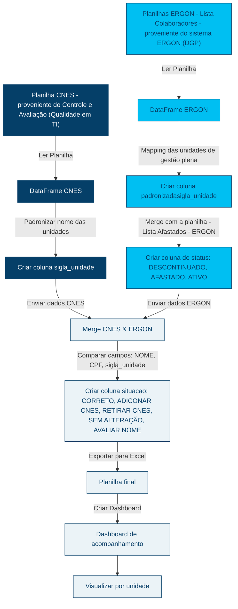

# Documentação da Pipeline CNES & Ergon

## Introdução
Esta documentação apresenta a pipeline de integração entre os sistemas CNES e ERGON, desenvolvida para aprimorar a comunicação e o alinhamento entre o recursos humanos (RH) das unidades e a Diretoria de Gestão de Pessoas (DGP) da RioSaúde.

## Descrição do Problema
A falta de alinhamento entre o RH das unidades e a DGP da RioSaúde tem resultado na existência de profissionais que exercem funções nas unidades de gestão da RioSaúde sem registro no sistema CNES.  
Para solucionar essa questão, foi desenvolvida uma ferramenta que compara a lista de colaboradores do ERGON com os registros do CNES, identificando quais profissionais estão devidamente cadastrados e quais não estão.  
Essa solução promove transparência institucional e otimiza a gestão de recursos humanos.

## Objetivo
- Comparar os dados do CNES e do ERGON, gerando uma planilha final com a situação de cada profissional.
- Criar um *dashboard* para visualização dos dados agregados e por unidade.

## ETL utilizada para o processamento dos dados

## Área Demandante
- Diretoria de Gestão de Pessoas (DGP)
- Controle e Avaliação (Qualidade em TI)

## Áreas Envolvidas
- Diretoria de Gestão de Pessoas (DGP)
- Controle e Avaliação (Qualidade em TI)
- Recursos Humanos (RH) das unidades

## Regras de Negócio
- Os nomes das unidades foram padronizados, desconsiderando os setores específicos onde os profissionais atuam.
- O período considerado para afastamento é de 180 dias dentro do mês vigente.  
Por exemplo, um profissional será removido da lista de ativos em abril apenas se completar 180 dias de afastamento até 30 de abril.  

<strong>Este parâmetro foi definido diretamente pela Secretaria Municipal de Saúde (SMS).</strong>

- A lista de profissionais utilizada como referência é proveniente do Controle e Capacitação (Qualidade em TI) antes do envio/retorno da SMS, sendo considerada a mais atualizada.
- A classificação dos profissionais segue as seguintes regras:
    - **CORRETO**: O profissional possui nome, CPF e unidade compatíveis nas listas do CNES e do ERGON, ou está identificado como "TERCEIRIZADO" ou "CEDIDO", indicando que é contratado por uma empresa prestadora de serviços.
    - **ADICONAR CNES**: O profissional está na lista do ERGON, mas não no CNES.
    - **REMOVER CNES**: O profissional consta no CNES, mas não na lista do ERGON.
    - **AVALIAR NOME**: Ao comparar os campos nome, CPF e unidade, existe alguma divergência na escrita do nome do colaborador.
    - **CORRIGIDO**: A classificação é alterada para CORRIGIDO após a adequação realizada pelo RH das unidades em resposta a uma classificação anterior de ADICIONAR CNES, REMOVER CNES ou AVALIAR NOME.
    - **SEM ALTERAÇÃO**: O profissional não se enquadra em nenhuma das situações acima.

## Schema e Dicionário de Dados
::: backend.schemas.schema_dgp_cnes.SchemaDGP_CNES_Output
    options:
        handler: python
        show_source: false
        show_if_no_docstring: false
        show_signature_annotations: false
        members: false
        show_root_toc_entry: false
