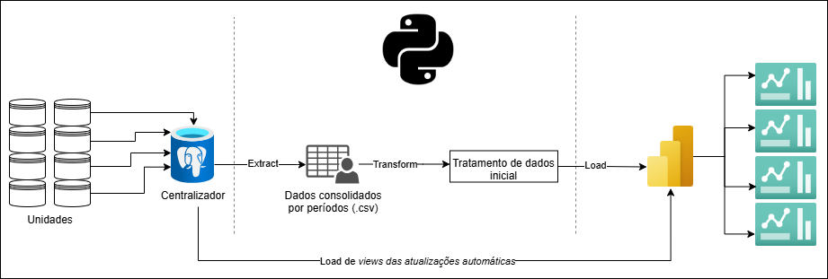

# Base Assistencial para Gerenciamento da Produtividade das Unidades de Saúde do município do Rio de Janeiro

## Introdução
O projeto "Dashboard de Acompanhamento de Performance das Unidades" visa centralizar e otimizar o acompanhamento da produtividade das unidades de saúde através de uma base de dados unificada.  
Desenvolvido pela Diretoria de Governança e Tecnologia da Informação (DGOVI) em parceria com a Vitai, o projeto integra dados de todas as unidades que utilizam o Prontuário Eletrônico do Paciente (PEP) da Vitai, incluindo aquelas geridas diretamente pela Secretaria Municipal de Saúde do Rio de Janeiro. Essa centralização permite a análise estratégica e a tomada de decisões informadas para melhorar a eficiência dos serviços de saúde.  
Desde sua criação, em abril de 2024, a base de dados tem sido constantemente atualizada e expandida, refletindo a grandiosidade e a inovação do projeto.

## Descrição do Problema
Devido a descentralização dos dados provenientes do PEP, onde cada unidade possui seu próprio banco de dados, obter informações sobre a produtividade das unidades de saúde do município do Rio de Janeiro era uma tarefa bastante complexa.  
Para facilitar e agilizar este processo, a DGOVI, junto da [Vitai](https://vitai.com.br/), desenvolveram uma base de dados unificada com dados de todas as unidades do município do Rio de Janeiro que possuem o PEP TIMed, *mesmo das unidades que sejam gerenciadas diretamente pela [Secretaria Municiapal de Saúde](https://saude.prefeitura.rio/) (SMS) do Rio de Janeiro*.  
Dessa forma tornou-se possível o acompanhamento da produtividade das unidades para que sejam tomadas decisões estratégicas para otimizar os serviços de saúde de forma mais eficiente.  
A base de dados foi inicializada em abril de 2024 e desde então vem sofrendo constante atualizações (adicionando mais dados e corrigindo inconsistências deles), além de implementações de novas tabelas e métricas.  
Sendo um projeto de uma grandiosidade inédita, o desenvolvimento deste projeto foi feito em etapas/versionamento, onde cada etapa era desenvolvida de acordo com os dados disponíveis naquele momento.  

## Objetivo
* Desenvolver um *dashboard* completo e intuitivo para acompanhamento da produtividade das unidades de saúde do município do Rio de Janeiro. A partir deste painel poderão ser tomadas decisões estratégicas baseadas em dados, como por exemplo:
    * TMP (Tempo Médio de Permanência) de admissões dos pacientes
    * TME (Tempo Médio de Espera) de atendimentos de pacientes
    * Quantidade de pacientes atendidos por especialidade/CID/risco
    * Quantidade de exames realizados
    * Produtividade dos profissionais vinculados a cada unidade
    * E muito mais...!

## ETL

## Área Demandante
* DGOVI

## Áreas Envolvidas
* DGOVI
* Vitai
