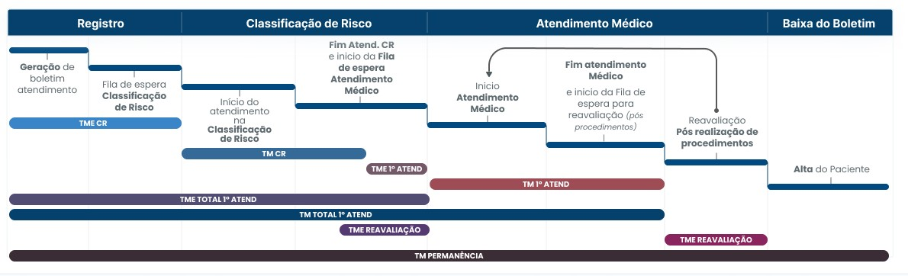
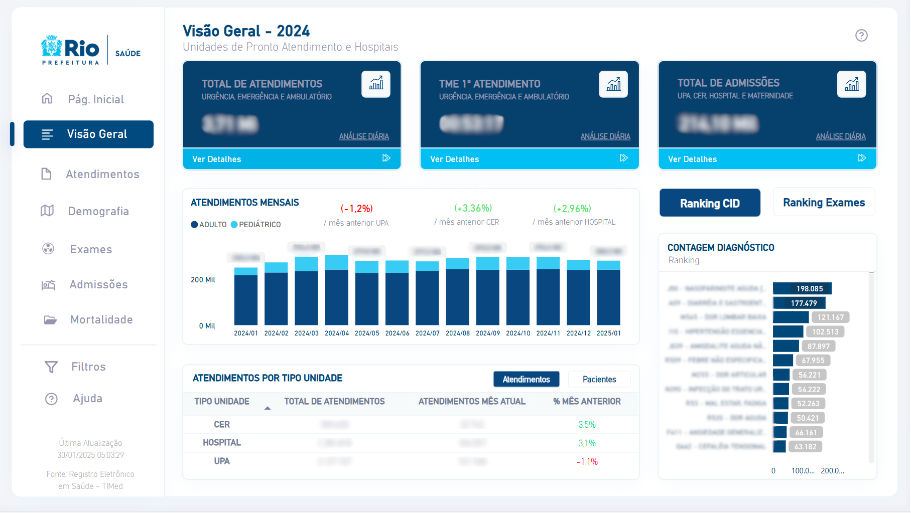
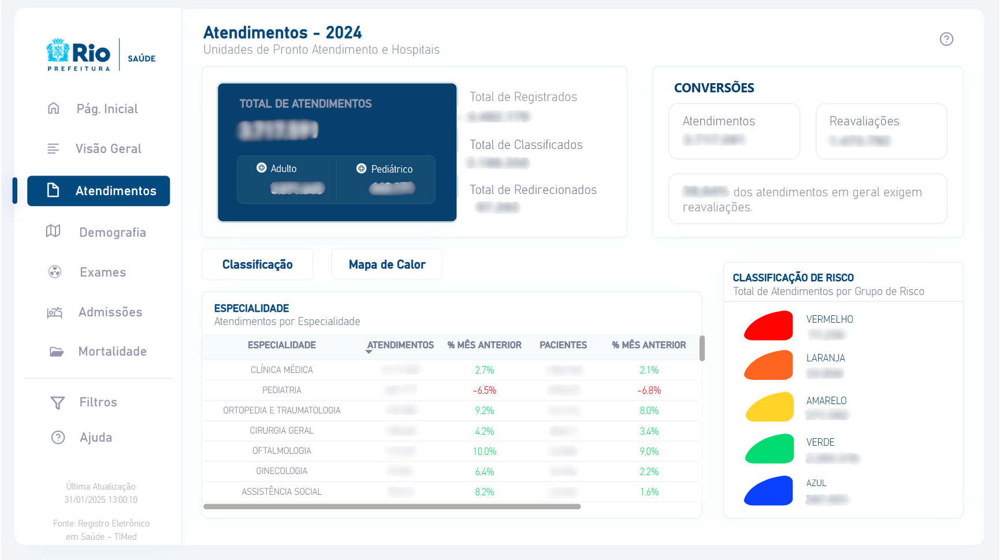
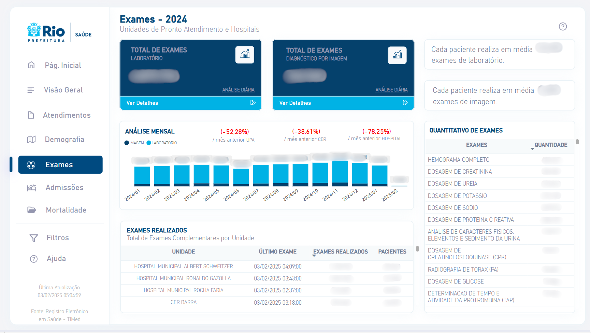
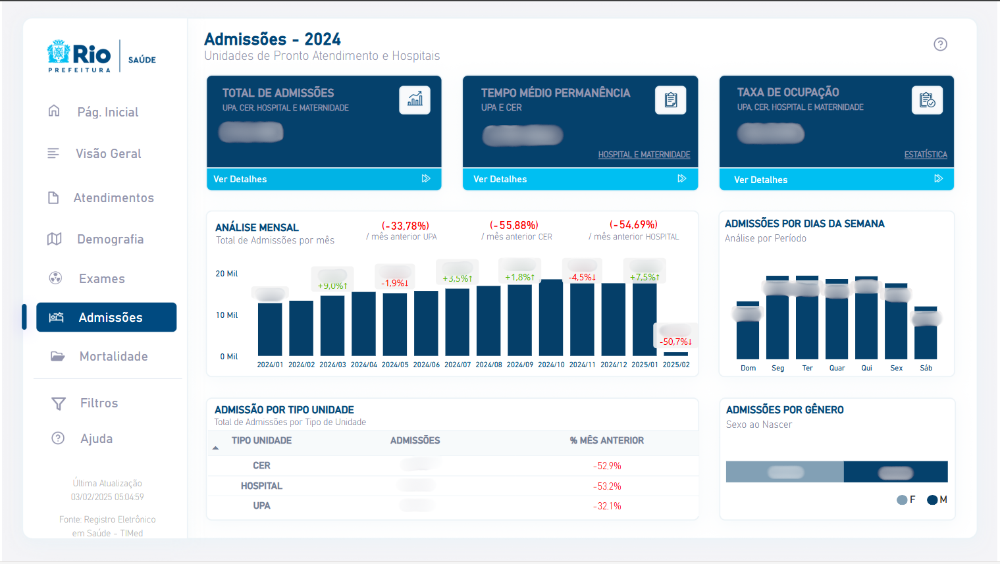
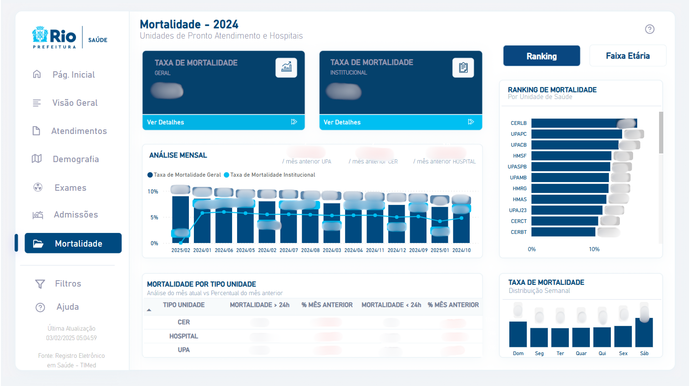

# Regras de Negócio

## Fluxo Assistencial em unidades de Urgência e Emergência 

**Total Atend**: Total de atendimentos realizados no período filtrado.  
**TME CR**: Tempo Médio de Espera para Classificação de Risco. Refere-se ao tempo médio que os pacientes aguardam para serem classificados quanto à urgência do atendimento.  
**TM CR**: Tempo Médio da Classificação de Risco. Representa o tempo médio gasto no processo de classificação de risco.  
**TME 1° Atend**: Tempo Médio de Espera até o 1° Atendimento. Indica o tempo médio que os pacientes aguardam, após a classificação de risco, até o início do primeiro atendimento médico.  
**TM 1° Atend**: Tempo Médio do 1° Atendimento. Refere-se ao tempo médio que os pacientes permanecem em consulta ou sendo atendidos na sala de atendimento.  
**TME TOTAL 1° Atend**: Tempo Médio de Espera Total até o 1° Atendimento. Consiste no tempo de espera desde o registro do paciente até o primeiro atendimento médico no consultório.  
**TM TOTAL 1° Atend**: Tempo Médio desde o registro do paciente até o término do 1° atendimento médico.  
**TME Reavaliação**: Tempo Médio de Espera para Reavaliação. Indica o tempo médio de espera dos pacientes para uma reavaliação médica após o primeiro atendimento.  
**TM Reavaliação**: Tempo Médio de Reavaliação. Refere-se ao tempo médio gasto no processo de reavaliação médica.  
**TM Permanência**: Tempo Médio de Permanência. Refere-se ao tempo médio total desde a admissão até a alta do paciente.  

## Visão Geral

**Total de atendimentos**: Quantidade total de atendimentos médicos realizados nos consultórios das unidades de urgência, emergência e ambulatório.  
**TME 1° atendimento**:  Tempo médio de espera desde o registro do paciente até o primeiro atendimento médico no consultório.  
**Total de admissões**: Total de pacientes admitidos nas unidades, seja por internação ou observação (UPAs CERs).  
**Atendimentos Mensais**: Total de atendimentos realizados em adultos e crianças, com comparação percentual em relação ao mês anterior, categorizado por tipo de unidade (UPA, CER e Hospital).  
**Atendimentos por Tipo Unidade**: Total de atendimentos no período filtrado, detalhando o volume de atendimentos do mês vigente e a variação percentual em relação ao mês anterior.  
**Ranking CID**: Lista dos principais diagnósticos registrados nos atendimentos médicos.  
**Ranking Exames**: Principais exames realizados nas unidades, permitindo alternância entre exames de imagem e laboratoriais.  

## Atendimentos

**Total de Registrados**: Total de boletins abertos, ou seja, pacientes registrados nas unidades.  
**Total de Classificados**: Total de pacientes que passaram pelo processo de classificação de risco nas unidades.  
**Total de Redirecionados**: Total de pacientes classificados com risco azul e redirecionados para atendimento na Clínica da Família.  
**Reavaliações**: Total de atendimentos realizados após a primeira avaliação médica.
Especialidade: Total de atendimentos por especialidade, incluindo a variação percentual em relação ao mês anterior e a soma de pacientes distintos.  
**Classificação de Risco**: Total de pacientes atendidos na classificação de risco, agrupados por nível de gravidade.  

## Demografia

**Faixa Etária**: Percentual de atendimentos realizados por grupo etário, excluindo reavaliações.  
**Sexo ao Nascer**: Percentual de atendimentos realizados por gênero, excluindo reavaliações.  
**Área Programática**: Percentual de atendimentos realizados por área programática, excluindo reavaliações.  
**Mapa**: Exibe a dispersão geográfica dos usuários das unidades de saúde. Utilize os botões acima (Atendimentos, Admissões, Exames e CID) para filtrar a visualização conforme a categoria desejada.  
**Unidade | %**: Representa o percentual de atendimentos, admissões ou exames em relação ao total das unidades.  

## Exames

**Total de Exames Laboratoriais**: Total de exames laboratoriais realizados e liberados.  
**Total de Exames de Imagem**: Total de exames de imagem realizados e liberados.  
**Análise Mensal**: Quantidade de exames laboratoriais e de imagem realizados ou liberados a cada mês.  
**Exames Realizados**: Total de exames realizados e liberados por unidade, incluindo a soma de pacientes distintos.  
**Quantitativo de Exames**: Lista de exames realizados com a respectiva quantidade.  

## Admissões

**Tempo Médio de Permanência UPA e CER**: Tempo médio entre a data de entrada na enfermaria e a data de alta.  
**Taxa de Ocupação**: Percentual da média de taxa de ocupação hospitalar de todas as unidades.  
**Admissões Semanais**: Total de admissões realizadas por dia da semana.  
**Admissões por Gênero**: Percentual de admissões realizadas por gênero.  
**Admissões por Tipo Unidade**: Total de internações, incluindo a comparação percentual em relação ao mês anterior.  

## Mortalidade

**Taxa de Mortalidade Geral**: Percentual de óbitos entre pacientes internados em relação ao total de saídas hospitalares.  
**Taxa de Mortalidade Institucional**: Percentual de óbitos entre pacientes internados por mais de 24 horas em relação ao total de saídas hospitalares no mesmo período.  
**Análise Mensal**: Comparação mensal entre as taxas de Mortalidade Geral e Institucional.  
**Mortalidade por tipo unidade**: Comparação da mortalidade em internações superiores e inferiores a 24 horas em relação ao mês anterior.  
**Ranking de Mortalidade**: Percentual de óbitos em relação ao total de óbitos registrados em todas as unidades de saúde.  
**Óbitos por Faixa Etária**: Distribuição dos óbitos por grupo etário.  
**Taxa de Mortalidade - Distribuição Semanal**: Percentual de óbitos registrados ao longo da semana.  

## Considerações

**Admissões**: Pacientes admitidos em leitos de unidades de modalidade hospitalares ou admitidos em leitos de unidades de modalidade de emergência em local de observação.  
**Comparação mês a mês**: Todas as comparações são feitas considerando o mesmo período dos meses envolvidos. Por exemplo, o período do dia 01 até 10 de janeiro é comparado com o período de 01 até 10 de dezembro.  
**Adulto | Pediatra**: A separação é feita pela idade do paciente e não pela especialidade do atendimento.  
- **Adulto**: 13 anos completos em diante  
- **Pediatra**: até 12 anos e 11 meses de vida  
